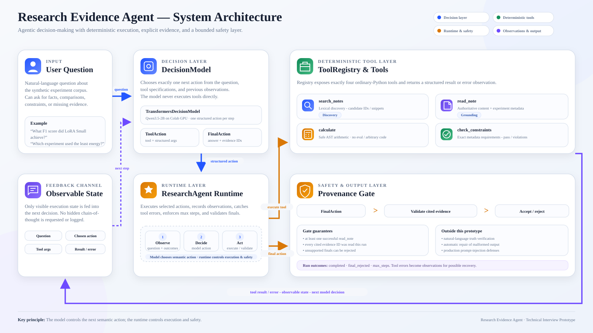

# Research Evidence Agent

A compact, explainable agent for answering evidence-grounded questions over a
local experiment corpus. The project separates model-driven next-action selection
from deterministic tool execution, explicit state, bounded execution, and
provenance validation.

## Why this is agentic

The next action is not hard-coded in the runtime. A `DecisionModel` chooses a
`ToolAction` or `FinalAction` from the question and previous observations, so a
later choice can depend on an earlier tool result. If the sequence were completely
predictable, a deterministic workflow would be preferable.

This keeps model autonomy focused on semantic decisions while ordinary Python
handles operations that are easier to make explicit, testable, and reliable.

## Architecture

<p align="center">
  
</p>

The diagram is available as [SVG](docs/architecture/research_evidence_architecture.svg);
its editable SVG source is kept in
[`docs/architecture/source/`](docs/architecture/source/research_evidence_architecture_source.svg).

`ResearchAgent` owns the explicit, single-agent observe-decide-act loop. The model
selects the next semantic action; ordinary Python validates and executes tool
calls, records observations, applies stopping rules, and routes final answers
through the provenance gate.

## Deterministic tools

The runtime exposes exactly four tools through `ToolRegistry`:

- `search_notes` performs lexical search over the local Markdown corpus and returns
  candidate document IDs, titles, and snippets.
- `read_note` retrieves authoritative content and metadata for one known document
  ID.
- `calculate` evaluates a small safe arithmetic syntax without unrestricted
  `eval`.
- `check_constraints` compares exact experiment metadata against structured
  numerical or boolean requirements.

The model can choose among these tools, but it never executes them directly.

## Reliability boundaries

- An explicit registry exposes only the four tools above.
- Model output is parsed into typed `ToolAction` or `FinalAction` values.
- Invalid model JSON is rejected rather than silently repaired.
- Tool failures become observations, allowing a later model decision to recover.
- `max_steps` bounds every run.
- The final-answer gate requires at least one successful `read_note` and requires
  every cited evidence ID to have been read during the current run.
- Missing measurements can produce a source-grounded insufficient-evidence answer
  instead of a guess.

The provenance gate is deliberately narrow: it verifies that cited evidence was
actually inspected. It does **not** prove that every natural-language claim is
true, and it does not currently enforce that every applicable hard constraint was
checked before finalization.

## Model options

### ScriptedModel

`ScriptedModel` returns predefined actions in sequence. It makes the agent loop,
tool execution, validation, and failure handling deterministic for tests and
evaluation without downloading a language model.

### TransformersDecisionModel

`TransformersDecisionModel` uses the open-weight `Qwen/Qwen3.5-2B` by default.
Inference can run in a Colab GPU runtime; no hosted inference API is required.
The adapter gives the model the user question, tool specifications, and previous
observable tool outcomes, then asks for exactly one structured next action.

Qwen thinking mode is disabled for this adapter because the runtime expects a
single structured action rather than free-form reasoning text. Generation is
currently deterministic with `do_sample=False`.

Core runtime dependencies are standard-library only. Optional Colab dependencies
are installed with `pip install -e ".[colab]"`. The Colab setup installs a recent
Transformers build from the official Hugging Face repository because Qwen3.5
support is newer than the stable minimum used by the core package.

## Run the real-model demo

After installing the optional model dependencies:

```bash
python real_demo.py \
  --question "What F1 score did LoRA Small achieve?"
```

To inspect the model-generated action object before strict parsing:

```bash
python real_demo.py \
  --question "What F1 score did LoRA Small achieve?" \
  --debug-action-json
```

`real_demo.py` prints only observable execution state: selected tools, validated
arguments, tool results or errors, final status, answer, and evidence IDs.

## Run tests

```bash
python -m pytest -q
```

## Run deterministic evaluation

```bash
python eval/evaluate.py
```

The ten scripted cases exercise observable runtime behavior including factual
retrieval, grounding, arithmetic, constraint checking, abstention, tool-error
recovery, and bounded execution. They evaluate the deterministic runtime path;
they do **not** represent Qwen accuracy or open-ended model quality.

For a minimal offline example, run:

```bash
python demo.py
```

## Colab demo

[`demo_colab.ipynb`](demo_colab.ipynb) demonstrates the same runtime with the
optional Transformers decision model and a clearly labeled scripted fallback.

## Scope and deliberate non-goals

This is a focused prototype rather than a production platform. The current design
intentionally prioritizes a small, inspectable agent loop and explicit reliability
boundaries over infrastructure breadth.

Deliberate non-goals include multi-agent orchestration, a vector database, a web
UI, production authentication, autonomous web browsing, cloud deployment
infrastructure, and automatic repair of malformed model output.

Known improvement areas include stronger schema-constrained/native tool calling,
repeated-action loop detection, expression-complexity limits for the calculator,
more capable retrieval, and production-grade prompt-injection defenses.
